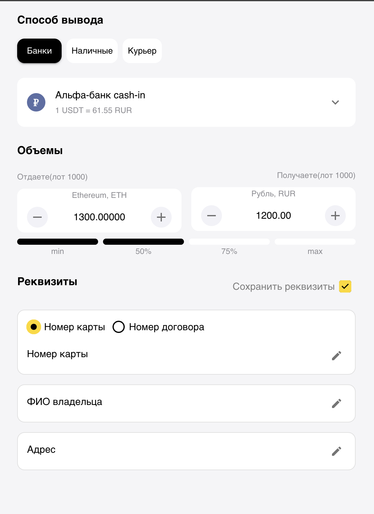

# Mobile MUI Page — Test Task

## Описание

Адаптивная мобильная страница вывода средств, реализованная на **React + TypeScript + MUI**.  
Проект выполнен по изображению макета, без бизнес-логики — исключительно визуальная реализация интерфейса.

## Стек

- React
- TypeScript
- MUI (Material UI v5)
- Emotion (styled engine)

---

## Условия выполнения

- Верстка выполнена по изображению макета («на глаз», без pixel-perfect)
- Компонентная база реализована на MUI
- Поля ввода реализованы через нативные `<input />` (`InputBase`)
- Бизнес-логика и интерактивность отсутствуют
- Адаптация под экраны **320–600px**
- Максимальное количество стилей вынесено в **MUI theme**
- Минимальное использование `sx` (только для layout)

---

Полное ТЗ и описание в папке ./assets/techRequirements.txt

Финальный результат - 

## Установка и запуск проекта

### Требования

- Node.js версии **16.x или выше**
- npm или yarn

### Установка зависимостей
- npm install

### Запуск в режиме разработки
- npm start